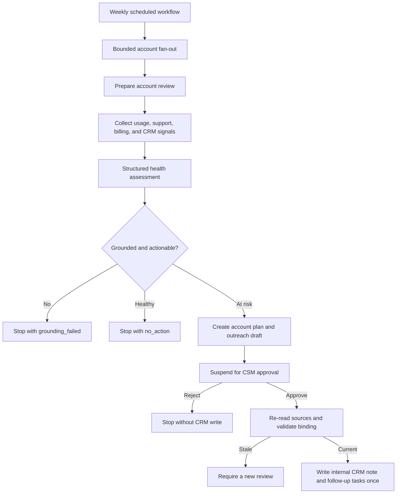

# Mastra primitives used by this template

This template combines Mastra's scheduling, workflows, agents, memory, tools,
structured output, approval, retries, request context, scorers, and
observability into one customer-success operating loop. This document maps each
primitive to the code that uses it and explains its role in the safety model.

## End-to-end flow



The workflow never sends customer-facing outreach. It stores the outreach as
an internal draft for a CSM to review and send through their normal process.

## Scheduled workflows

`src/mastra/workflows/scheduled-workflow.ts` defines
`weekly-customer-success` with Mastra's `createWorkflow` and `schedule`
configuration.

- `CUSTOMER_SUCCESS_CRON` controls the cron expression. The default is Monday
  at 09:00.
- `CUSTOMER_SUCCESS_TIMEZONE` controls the schedule timezone. The default is
  UTC.
- The scheduled input contains the configured tenant ID.
- The fan-out step lists accounts through the active CRM adapter.
- `MAX_ACCOUNT_CONCURRENCY` bounds parallel account execution between 1 and 25.
- Each account receives its own workflow run ID and failure boundary. One
  provider failure does not abort the other accounts.
- A suspended account counts as a successfully started review because it is
  intentionally waiting for a CSM.

The scheduled workflow delegates account decisions to
`customer-success-account`; it does not duplicate assessment or approval logic.

## Account workflow, steps, and retries

`src/mastra/workflows/account-workflow.ts` defines the three-step
`customer-success-account` workflow:

1. `prepare-account-review` collects sources, builds the assessment, calculates
   drift, creates the plan and outreach draft, and persists the approval
   request when action is required.
2. `request-csm-approval` suspends the run and exposes the approval request as
   the suspend payload. Resuming the step supplies a Zod-validated approval or
   rejection.
3. `write-approved-crm-draft` revalidates the decision and current source data,
   then invokes the configured CRM writer only when every guard passes.

The preparation step and scheduled fan-out both declare `retries: 2`. Mastra
therefore permits three total attempts. A retryable provider failure is raised
as `ProviderUnavailableError` during the retry budget; after the final attempt,
the run returns the explicit `unknown_retry` outcome instead of pretending that
unavailable data is empty.

## Structured outputs and Zod contracts

All workflow inputs, outputs, suspend payloads, resume payloads, tool inputs,
tool outputs, source records, assessments, plans, outreach drafts, monitoring
events, and CRM write results are Zod schemas in
`src/mastra/schemas/index.ts`.

In model mode, `src/mastra/adapters/model/mastra-intelligence.ts` calls the
Mastra agent with `structuredOutput` for three distinct artifacts:

- a health assessment;
- an account plan;
- an outreach draft.

Structured output validates shape, but it is not the final safety boundary.
`src/mastra/services/grounding.ts` independently resolves every evidence
reference against the normalized source snapshot, replaces generated narrative
with canonical evidence-backed text, and rejects unsupported, redacted, empty,
null, or `unknown` evidence.

Request identity is authoritative. Model-produced tenant, account, and `asOf`
values are overwritten with workflow input values before artifacts can reach
memory, approval, or CRM writes.

## Agent

`src/mastra/agents/customer-success-agent.ts` creates the Mastra `Agent` used
when `GENERATION_MODE=model`.

- `MODEL` selects the model-router identifier.
- Agent instructions require exact record and field evidence, prohibit invented
  customer intent, and keep outreach draft-only.
- `maxRetries: 2` applies to model generation failures.
- Assessment, planning, and outreach use separate memory thread IDs while
  sharing the same account resource scope.

The default fixture mode uses deterministic intelligence and does not require a
model API key. The workflow, grounding, approval, monitoring, and CRM contracts
are the same in both modes.

## Working memory

Mastra working memory is configured through `Memory` in
`src/mastra/agents/customer-success-agent.ts`.

- It is always enabled in model mode.
- Its scope is `resource`, where the resource key combines tenant and account.
- The template records current verified risks, last approved actions, and open
  CSM questions.
- The agent also receives the last ten messages for its scoped thread.

This memory helps generation remain consistent across reviews. It is not the
authoritative source for risk-score drift or approval state.

## Observational memory

Observational memory is opt-in with:

```env
ENABLE_OBSERVATIONAL_MEMORY=true
```

When enabled, Mastra uses the configured model to create observations and
buffers them when the resource becomes idle. It can improve long-running
account context, but it adds model calls and cost. It remains advisory; the
typed operational store still controls decisions.

## Semantic recall

Semantic recall is opt-in with:

```env
ENABLE_SEMANTIC_RECALL=true
EMBEDDING_MODEL=openai/text-embedding-3-small
```

The memory configuration retrieves the top three resource-scoped matches with
a one-message surrounding range. `LibSQLVector` uses the same database URL and
optional Turso authentication as the main Mastra storage. The selected
embedding provider must have valid credentials.

`npm run demo:model-memory` exercises working memory, observational memory,
semantic recall, repeated assessment, and usage/cost capture together.

## Authoritative operational memory

`src/mastra/memory/operational-stores.ts` implements a separate typed memory
layer for business-critical state:

- account assessment and drift history;
- the last account plan;
- approval requests and decisions;
- idempotency records;
- durable CRM write intents;
- monitoring events.

Production composition uses LibSQL; fixture tests use the in-memory
implementation of the same interfaces. Account history keeps the latest 12
assessment entries and is isolated by a length-delimited tenant/account scope
key.

The distinction is intentional: Mastra model memory helps the agent reason,
while operational memory determines drift, approval freshness, and exactly-once
CRM behavior.

## Request context

Mastra `RequestContext` carries trusted identity without adding it to generated
content.

- Scheduled runs set `tenant-id` and `account-id` before starting each account
  workflow.
- The preparation step rejects either value when it conflicts with workflow
  input.
- A host application can set `csm-id` during resume. The approval step then
  requires `approverId` to match it.
- Observability retains `tenant-id` and `account-id` as request-context keys for
  trace correlation.

Only trusted middleware should populate these values. User-provided text should
not be copied into RequestContext identity keys.

## Approval and suspend/resume

The approval gate uses Mastra workflow suspension rather than a blocking loop.
When an account requires action, the workflow persists an approval request and
suspends with:

- the artifact bundle hash;
- the assessment `asOf` timestamp;
- the request time;
- the maximum expiry time.

The resume payload includes the CSM decision, approver identity, decision time,
expiry, and the same hidden binding values. Before writing, the service checks
the persisted request, exact hash binding, timestamp bounds, current source
snapshot hash, and optional RequestContext approver identity.

Approval normally happens in Mastra Studio or a host application that calls the
workflow resume API. A CRM-native approval button is an optional adapter to the
same resume operation.

## CRM tools

`src/mastra/tools/crm-tools.ts` registers three provider-neutral Mastra tools:

| Tool | Purpose | Approval |
| --- | --- | --- |
| `list-customer-accounts` | List normalized accounts | Read-only |
| `read-customer-crm-notes` | Read normalized notes for one account and window | Read-only |
| `write-approved-customer-success-draft` | Write an approved internal draft and tasks | Mastra tool approval required |

The tools depend on `CrmRepository` and `CrmWriter`, not HubSpot types. Adopters
can replace HubSpot with another CRM without changing the workflow contracts.

Tool approval is defense in depth. The account workflow still requires its
stronger, artifact-bound CSM approval before performing an operational write.

## Scorers

Five Mastra scorers are registered in `src/mastra/index.ts`, making them
available to Mastra's evaluation tooling and Studio:

- groundedness;
- risk-factor extraction;
- account-plan quality;
- outreach personalization;
- action relevance.

Their exact behavior, fixture cases, and CI thresholds are documented in
[Evals](./evals.md).

## Observability

`src/mastra/index.ts` configures Mastra `Observability` with a realtime
`MastraStorageExporter`. Workflow, step, agent, and tool spans are persisted in
the configured Mastra storage for Studio trace inspection.

`SensitiveDataFilter` redacts authorization values, tokens, CRM and outreach
bodies, subjects, feedback, notes, and email fields. In addition, customer free
text is removed before model prompts are serialized, so prompt traces do not
depend on the span filter alone.

Business monitoring and trace observability are complementary. The event
schema, report calculations, privacy behavior, and extension points are
documented in [Monitoring](./monitoring.md).

## Composition and connector replacement

`src/mastra/composition/create-composition.ts` is the composition root. It
chooses fixture or HubSpot CRM adapters, deterministic or model intelligence,
storage, vector storage, memory, tools, and the orchestration service from
validated environment configuration.

To add a provider, implement the relevant interfaces from
`src/mastra/ports/index.ts` and replace the binding in the composition root.
The workflow, approval, schemas, evals, and monitoring do not need
provider-specific changes.
